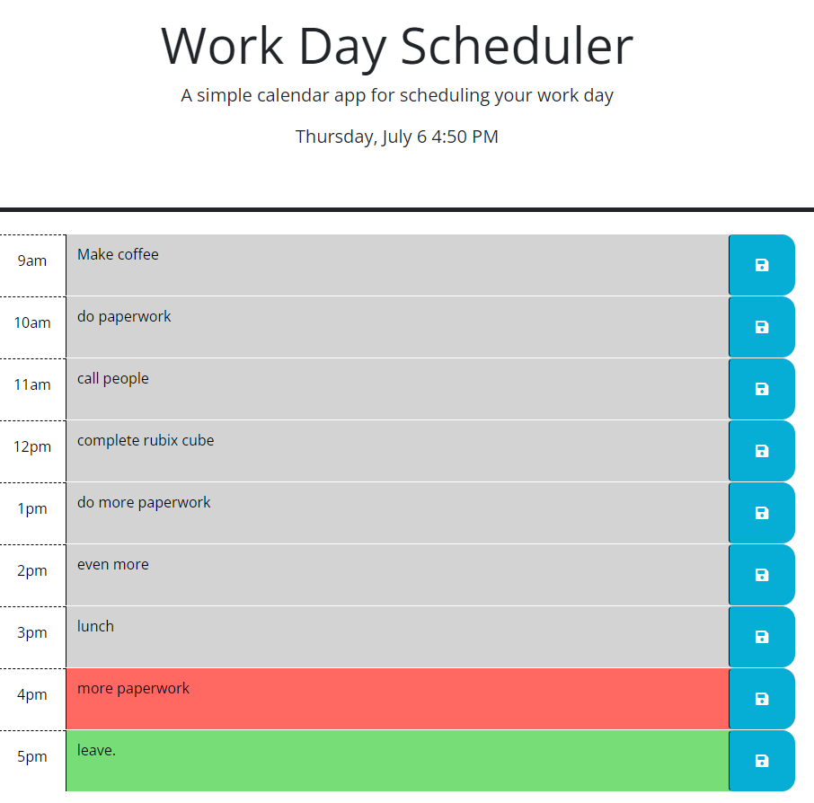

# Daily Planner

This is a simple daily planner application designed for employees with busy schedules. It allows users to add important events to a daily planner, helping them manage their time effectively. The application provides the following features:

## Features

- The current day is displayed at the top of the calendar when the planner is opened.
- Timeblocks for standard business hours of 9am to 5pm are presented when scrolling down.
- Each timeblock is color-coded to indicate whether it is in the past, present, or future.
- Users can click into a timeblock to enter an event.
- Users can save the text for an event in local storage by clicking the save button for that timeblock.
- The saved events persist even after the page is refreshed.

## Usage

To use the daily planner, follow these steps:

1. Open the daily planner application.

2. The current day and time will be displayed at the top of the calendar.
3. Scroll down to view the timeblocks for the day.
4. Each timeblock will be color-coded to indicate whether it is in the past, present, or future.
5. Click into a timeblock to enter an event.
6. After entering the event, click the save button for that timeblock to save the text in local storage.
7. The saved events will persist even after refreshing the page.

## Implementation Details

The daily planner application is implemented using HTML, CSS, and JavaScript. It utilizes the Day.js library for working with dates and times.

The JavaScript code provides the following functionality:

- It dynamically generates the time blocks for standard business hours (9am to 5pm).
- It applies the appropriate CSS class to each time block to indicate whether it is in the past, present, or future.
- It loads saved events from local storage and displays them in the corresponding time blocks.
- It saves events to local storage when the save button is clicked.
- It shows a save message to indicate that the event has been saved successfully.

The application is designed to be simple and user-friendly, providing a convenient way for employees with busy schedules to manage their time effectively.

## Development

To modify or enhance the daily planner application, follow these steps:

1. Clone the repository or download the source code.
2. Make the necessary changes using your preferred code editor.
3. Test the application locally to ensure it works as expected.
4. Deploy the updated application to a web server or hosting platform.

## Credits

The daily planner application was developed by [Keybit-1].

## License

This project is licensed under the [MIT License](LICENSE).

 
